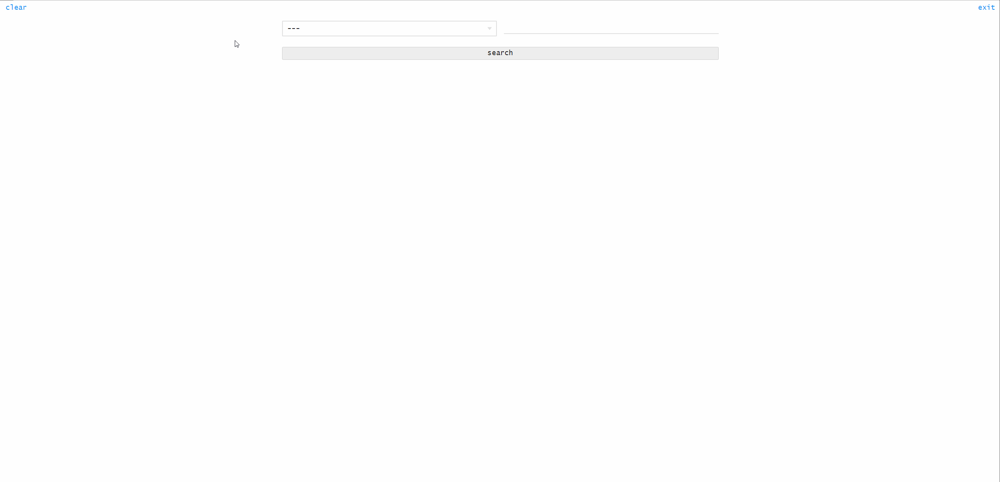

# Shopify Bot

## Server backend
Cloudflare Worker written in Rust. 
Uses data from POST request from user to find item on a Shopify site. Returns matching item sizes, availability, price, and with immediate checkout link for items found in stock.

## App frontend
JS React webapp to interact with server backend. 
Select store to search, enter a keyword in search bar for item to search for.
Any items found matching the keyword will be displayed on the page with a checkout link generated for each item in stock.

  
 

